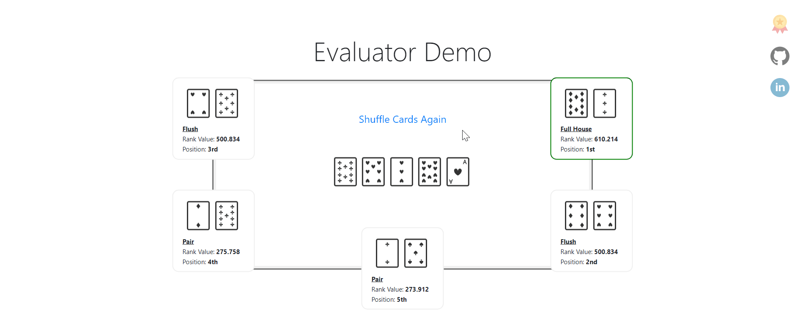

## Welcome to my Portfolio

Here you can see some of my projects that I've been working on in my academic studies or in my free time.

### Online Texas Holdem Game

Online poker game based on .NET, CSS and JavaScript used widely in this project.

**[C#](https://github.com/danielpaz6?tab=repositories&q=csharp)**
**[.NET](https://github.com/danielpaz6?tab=repositories&q=.NET)**
**[Entity Framework](https://github.com/danielpaz6?tab=repositories&q=EntityFramework)**
**[JavaScript](https://github.com/danielpaz6?tab=repositories&q=js)**
**[jQuery](https://github.com/danielpaz6?tab=repositories&q=jquery)**
**[CSS3](https://github.com/danielpaz6?tab=repositories&q=css3)**
**[Bootstrap](https://github.com/danielpaz6?tab=repositories&q=bootstrap)**

For live demo please visit [jspoker.net](https://jspoker.net)

### Neural Network Builder

Deep neural networks can be hard to understand, and notoriously difficult to plan and modify. I built a user interface website using React.JS that allows you to easily visualize and make modifications in neural network architectures.

**[React.JS](https://github.com/danielpaz6?tab=repositories&q=reactjs)**
**[Redux](https://github.com/danielpaz6?tab=repositories&q=redux)**
**[TypeScript](https://github.com/danielpaz6?tab=repositories&q=typescript)**
**[Drag-and-Drop](https://github.com/danielpaz6?tab=repositories&q=Drag-and-Drop)**
**[graph-alogrithms](https://github.com/danielpaz6?tab=repositories&q=graph-algorithms)**
**[Bootstrap](https://github.com/danielpaz6?tab=repositories&q=bootstrap)**

For more details see [NNBuilder Repository](https://github.com/danielpaz6/NNBuilder).

### Edit Code Online

A MERN stack website that allows you to code, chat and draw with friends in a live environment. 
I also made a nice responsive UI with a lot of CSS3 features.

**[React.JS](https://github.com/danielpaz6?tab=repositories&q=reactjs)**
**[Next.JS](https://github.com/danielpaz6?tab=repositories&q=nextjs)**
**[Redux](https://github.com/danielpaz6?tab=repositories&q=redux)**
**[Node.JS](https://github.com/danielpaz6?tab=repositories&q=nodejs)**
**[socket.io](https://github.com/danielpaz6?tab=repositories&q=socketio)**
**[mern-stack](https://github.com/danielpaz6?tab=repositories&q=mern-stack)**
**[jwt](https://github.com/danielpaz6?tab=repositories&q=jwt)**
**[css3](https://github.com/danielpaz6?tab=repositories&q=css3)**

For live demo please visit [editcode.herokuapp.com](https://editcode.herokuapp.com/)

### Texas Holdem Hand Evaluator

An algorithm that gives a rating to each player's hand with a nice UI that I made.

**[C#](https://github.com/danielpaz6?tab=repositories&q=csharp)**
**[.NET](https://github.com/danielpaz6?tab=repositories&q=.NET)**
**[JavaScript](https://github.com/danielpaz6?tab=repositories&q=js)**
**[jQuery](https://github.com/danielpaz6?tab=repositories&q=jquery)**
**[CSS3](https://github.com/danielpaz6?tab=repositories&q=css3)**
**[Bootstrap](https://github.com/danielpaz6?tab=repositories&q=bootstrap)**

For more details see [Poker-Hand-Evaluator Repository](https://github.com/danielpaz6/Poker-Hand-Evaluator).

### Tetris Game

A tetris game I made using React.JS, Hooks, CSS3 and a nice minimal UI using react-bootstrap.

**[React.JS](https://github.com/danielpaz6?tab=repositories&q=reactjs)**
**[hooks](https://github.com/danielpaz6?tab=repositories&q=hooks)**
**[JavaScript](https://github.com/danielpaz6?tab=repositories&q=js)**
**[CSS3](https://github.com/danielpaz6?tab=repositories&q=css3)**
**[Bootstrap](https://github.com/danielpaz6?tab=repositories&q=bootstrap)**

For more details see [React-Tetris-Game Repository](https://github.com/danielpaz6/React-Tetris-Game).

### Covid19 Statistics

A React JS application to Track Corona infected people using Material UI and Chart JS.

**[React.JS](https://github.com/danielpaz6?tab=repositories&q=reactjs)**
**[ChartJs](https://github.com/danielpaz6?tab=repositories&q=ChartJs)**
**[Material-UI](https://github.com/danielpaz6?tab=repositories&q=Material-UI)**
**[TypeScript](https://github.com/danielpaz6?tab=repositories&q=typescript)**
**[CSS3](https://github.com/danielpaz6?tab=repositories&q=css3)**

For more details see [React-covid-19-app Repository](https://github.com/danielpaz6/react-covid-19-app).

### Flight Simulator Controller GUI

A code where you can control an airplane simulator using a joystick or script, with a nice interface GUI.

**[Java](https://github.com/danielpaz6?tab=repositories&q=java)**
**[JavaFX](https://github.com/danielpaz6?tab=repositories&q=javafx)**
**[mvvm-architecture](https://github.com/danielpaz6?tab=repositories&q=mvvm-architecture)**
**[design-patterns](https://github.com/danielpaz6?tab=repositories&q=design-patterns)**

For more details see [FlightSimulatorControl Repository](https://github.com/danielpaz6/FlightSimulatorControl).
